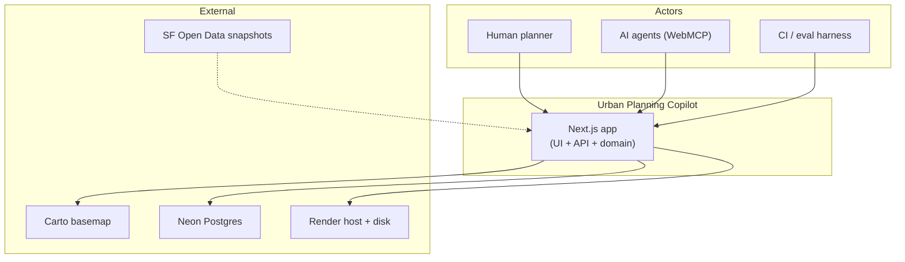
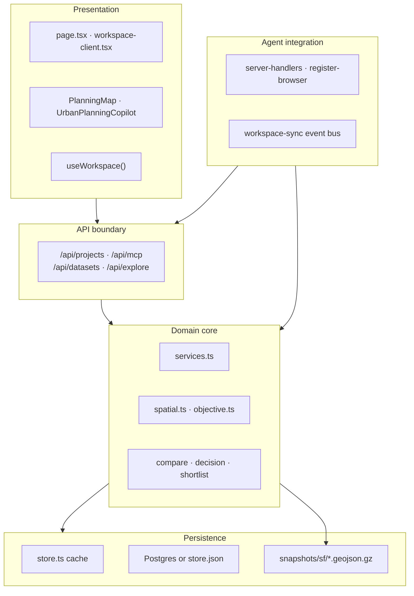
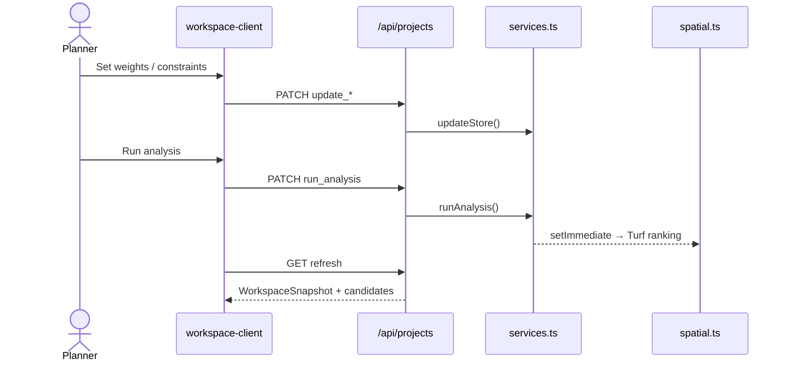
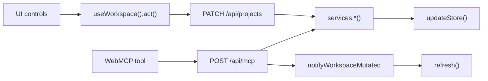

# Urban Planning Copilot

Production-oriented AI-native urban planning workspace.

**Live app:** https://urban-planning-copilot.heisenbug.in/

## What this is

A map-first planning application where human planners and an AI collaborator share one domain state: objectives, constraints, spatial analysis, scenarios, evidence, decisions, and reports.

Humans use the workspace UI; agents use **browser WebMCP** semantic tools on the same live app (not DOM scraping). UI actions and agent tools both call `src/lib/domain/services.ts`.

Visual reference: `stitch_urban_planning_copilot/`. Architecture spec: `SPEC.md`. Evaluation rubric: `EVAL.md`.

## Architecture

Urban Planning Copilot is a **single-deployable, server-authoritative monolith**: Next.js UI + API routes + domain logic + in-process spatial analysis. Humans and WebMCP agents share one domain state — every mutation converges on `src/lib/domain/services.ts`.

### System context



### Layers



### Planning journey



### Dual client — one state



Key paths: `src/app/workspace/[projectId]/workspace-client.tsx` (planner shell), `src/lib/domain/services.ts` (mutations), `src/lib/webmcp/` (agent tools), `src/lib/domain/store.ts` (persistence).

## Run locally

```bash
npm install
npm run seed    # optional demo projects
npm run dev
```

Open [http://localhost:3000](http://localhost:3000).

```bash
npm test
npm run build
```

## Stack & persistence

- Next.js (App Router), React, TypeScript, Tailwind CSS
- Leaflet / Turf.js for map rendering and server-side spatial analysis
- WebMCP journey tools — see [`webmcp/README.md`](./webmcp/README.md)
- Local: `store.json` under `DATA_DIR`. Production: set `DATABASE_URL` to a Postgres URI (e.g. Neon) so projects survive deploys
- Geography seed data in `snapshots/sf/`; missing required datasets fail analysis closed (no fabricated results)

## WebMCP

Enable in Chrome: `chrome://flags/#enable-webmcp-testing`, or the [origin trial](https://developer.chrome.com/blog/ai-webmcp-origin-trial), or ChatGPT in-app browser when available.

Consequential actions (approve, reject, generate report) require human confirmation in the UI. Debug tools: Chrome DevTools → Application → WebMCP, or nekuda Workbench (Alt+K).

```bash
npm run eval:webmcp:local    # schema + fixture validation
npm run eval:webmcp:smoke    # live page smoke (dev server required)
```

**Demo prompts** (natural language, no tool names): [`docs/prompts.md`](./docs/prompts.md)

## Planner workflow

1. Create a project with a natural-language objective
2. Review the analysis plan and run spatial analysis
3. Inspect ranked candidates on the map and in the results table
4. Adjust weights, transit threshold, or exclusions → recalculate when stale
5. Branch scenarios, compare, shortlist, and record a human decision
6. Generate a report

## Design tokens

- Intelligence Blue (`#005E7D`, `primary-container`) — AI recommendations and agent activity
- Human Amber (`#815504`, `secondary`) — planner decisions, shortlist, manual review
- Provenance chips: Observed · Calculated · AI REC · MANUAL

## License

MIT — see [LICENSE](./LICENSE).
